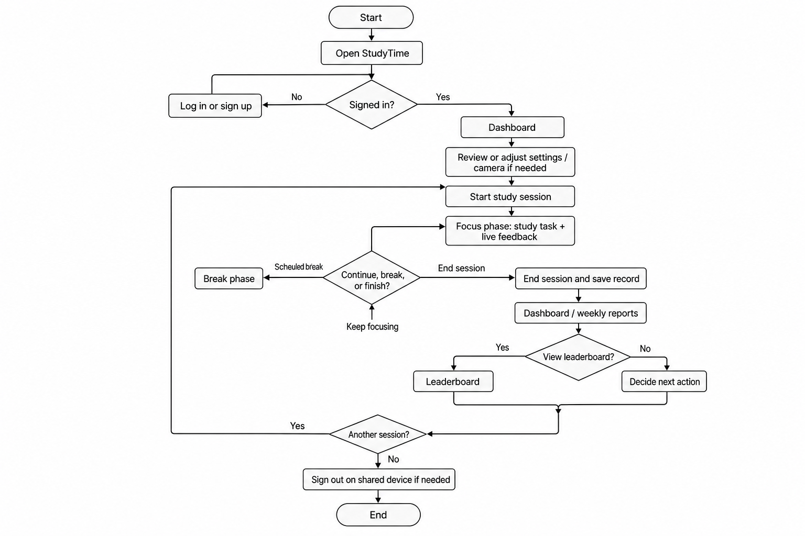
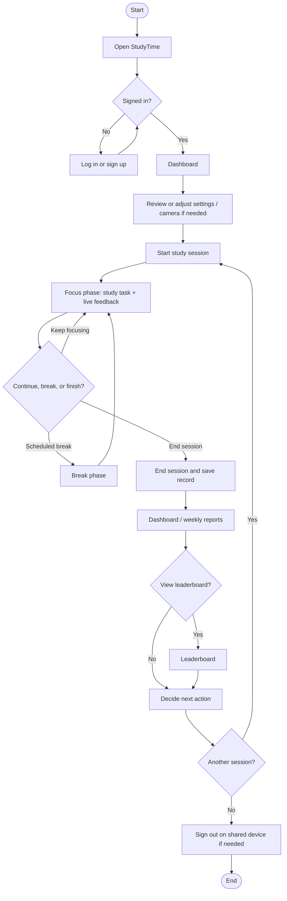

# Part 1: Understanding the Problem

**Project:** StudyTime  
**Course:** [Course code / instructor name — fill in]  
**Due:** May 15, 2026, 6:00 AM  

**Team name:** Paqueca — Group 12  

**Members:**

- Nicholas Klein Y. Castillanes  
- Kirk Roden C. Pacanan  
- Gary Louise R. Querequencia  

---

## 1. How we gathered information (and why these methods)

We grounded this report in **three complementary sources**, chosen to balance depth, honesty about our stage in the project, and fit with Part 1’s goal (understanding the problem before locking a final design).

**A. Interpretive evaluation of the StudyTime prototype**  
We walked through the current web application as critical users: authentication, dashboard, study session (camera and timers), reports, leaderboard, and settings. We noted what the interface *communicates*, what it *assumes* about the user’s environment, and where breakdowns or anxieties might appear (e.g., permissions, empty states, trust in scores). This method is appropriate because StudyTime is the **existing system** we are evolving; structured inspection surfaces concrete constraints (browser-only vision, lighting sensitivity) that abstract interviews alone might miss.

**B. Internal document review**  
We reviewed the project README and in-app copy to align our problem description with stated intent (focus monitoring, Pomodoro-style sessions, weekly reporting, optional cloud sync). This reduces the risk of inventing a problem statement that diverges from what the system actually tries to do.

**C. Structured team reflection**  
The three of us are **tertiary-level students** who regularly study online or in hybrid settings. We held a short structured discussion (guided prompts: *When do you lose focus? What do you do when you “feel” unproductive? What would make you distrust a study app?*). This is **not** a statistically representative sample; we treat it as **hypothesis-generating** context, not proof of prevalence in the whole student population.

**Methods we did not use (yet) and why**

- **Large-scale survey or formal usability tests with external participants:** Part 1’s timeline and scope favor deep framing over recruiting and instrument design; we plan broader empirical work after Part 2 stabilizes the design questions.  
- **Longitudinal ethnography in dormitories or libraries:** High burden on participants and privacy concerns when recording study behavior; webcam-based products already raise sensitivity, so we did not combine that with field shadowing in Part 1.  
- **Biometric lab equipment (eye trackers, etc.):** Inaccessible for our context; StudyTime itself targets consumer webcams, so evaluation should eventually mirror **real** hardware, not lab-only conditions.

Together, these methods give us **traceable evidence** (prototype + docs) plus **lived-student perspective** (team reflection), while being explicit about limits on generalizability.

---

## 2. Overview of the problem and why a system or interface is necessary

**Problem in brief:** Many students today carry out a large share of **self-directed study** at home or in informal spaces, often alongside **digital distractions** (messaging, social feeds, streaming) and **ambiguous feedback** about whether they were “actually studying.” Traditional tools—timers, to-do lists, calendars—help with *scheduling* but give little insight into **sustained attention** during a block of work. The result is a recurring gap between **felt effort** (time spent at the desk) and **focused effort** (time on task with attention aligned to learning goals). That gap feeds stress, self-blame, and difficulty improving habits because the user lacks **actionable, time-bound feedback**.

**Why an interactive system matters:** Attention during solo study is **partially observable** through lightweight sensors many laptops already have (webcam, microphone optional). A **purpose-built interface** can (1) **externalize** focus and breaks so the user does not have to constantly self-monitor, (2) **record** sessions in a way that supports later reflection without relying on memory, and (3) **connect** individual sessions to longer arcs (weekly trends, streaks, peer-relative motivation where appropriate). Without such a system, the problem remains **cognitively invisible**: the user knows they are tired or behind on readings, but not *when* or *how often* attention drifts in ways that are fixable through environment or habit changes.

StudyTime sits in this space as a **study companion** that makes focus and session structure **visible and reviewable**, while remaining bounded in its claims (supportive feedback, not high-stakes assessment).

---

## 3. Important characteristics of potential users

We expect **primary users** to be:

- **Higher-education students** (undergraduate and early graduate), including **hybrid and fully online** learners.  
- Learners who already use **laptops** for readings, problem sets, and video lectures.  
- Students who are **motivated enough** to start a session but struggle with **consistency**, **phone use**, or **long uninterrupted blocks**.

**Relevant user attributes (for design consequences):**

| Characteristic | Why it matters |
|----------------|----------------|
| **Variable study spaces** | Lighting, background clutter, and camera angle affect vision-based signals; users cannot always control the dorm or café environment. |
| **Heterogeneous devices** | Different webcam quality, CPU load, and browser behavior change latency and reliability of live feedback. |
| **Privacy sensitivity** | Camera use for monitoring raises questions of **trust**, **data storage**, and **who can see aggregates** (e.g., leaderboards). |
| **Accessibility and inclusion** | Not everyone can use webcam-based cues equally (e.g., some visual differences, covering camera for cultural or safety reasons); the user base is broader than “ideal” lab conditions. |
| **Motivation profiles** | Some users want **competition**; others want **private self-improvement** only. The same UI can alienate one group if tuned only for the other. |
| **Academic workload volatility** | Exam weeks vs. light weeks change acceptable session length, break ratios, and tolerance for nudges. |

**Secondary stakeholders (not always “users” of the chair):**

- **Institutions** (integrity norms, acceptable use of recording/analytics).  
- **Housemates or family** who share spaces and may appear on camera inadvertently.  

These characteristics imply that any design must treat **trust, control, and environmental realism** as first-class requirements, not afterthoughts.

---

## 4. Task analysis

### 4.1 Important characteristics of the tasks users seek to perform

- **Time-bounded deep work:** Users want to **start**, **stay in**, and **end** study blocks with clear boundaries (focus vs. break).  
- **Environmental setup:** Granting permissions, positioning the camera, adjusting thresholds so alerts feel fair.  
- **In-session regulation:** Recovering from distraction, interpreting live feedback without it becoming another distraction.  
- **Post-session sensemaking:** Understanding **how** the session went (averages, ratios, events), not only that it ended.  
- **Longer-horizon planning:** Connecting today’s session to **weekly patterns** and optional **social comparison** (leaderboard).  
- **Account and preference management:** Login, theme, thresholds, and understanding where data lives (local vs. cloud).

Tasks are **interruptible** (messages, roommates, fatigue) and **emotionally loaded** (guilt, pride), so the system’s tasks are never purely mechanical.

### 4.2 Important characteristics of the task environment

- **Physical:** Often a **desk + laptop**; sometimes **low light** or **backlit** windows; occasional **shared rooms**.  
- **Digital:** Multiple tabs, LMS, messaging, entertainment one click away; notifications from other apps.  
- **Social:** Solitude is common; **peer visibility** (leaderboard) introduces a **social layer** that may help or harm depending on norms.  
- **Technical:** Web browser, **HTTPS or localhost** for camera APIs, variable **network** if cloud sync is enabled.  
- **Temporal:** Sessions may occur **late night** or between classes; short fragmented windows compete with long “ideal” blocks.

The environment is **semi-controlled** at best; the system must degrade gracefully when vision or network is imperfect.

### 4.3 Structured task analysis (hierarchical overview)

We represent the high-level goal and subtasks in **HTA-style** form: plan numbers indicate order; `{n}` means repeat until a condition holds.

**Goal: Complete a meaningful study period with awareness of focus**

1. **Prepare to study**  
   1.1 Choose location and device  
   1.2 Open StudyTime and authenticate  
   1.3 Configure or confirm settings (focus thresholds, theme, optional features)  
   1.4 If using camera-based features: grant permission, verify preview, adjust framing/lighting  
   *Plan: 1.1 → 1.2 → 1.3 → 1.4 as needed*

2. **Run a study session**  
   2.1 Start session and timer/focus phase  
   2.2 `{2.2}` Monitor live feedback while working on academic tasks  
   2.3 Respond to distractions (internal or external)  
   2.4 Use breaks as offered  
   2.5 End session and confirm save  
   *Plan: 2.1 → (2.2–2.4)* → 2.5*

3. **Review and orient**  
   3.1 View dashboard or weekly report  
   3.2 Interpret aggregates (average focus, time on task, streaks)  
   3.3 Optionally compare to peers (leaderboard)  
   3.4 Decide next action (another session, rest, change settings)  
   *Plan: 3.1 → 3.2 → 3.3 if desired → 3.4*

4. **Maintain account and trust**  
   4.1 Understand where data is stored  
   4.2 Sign out or switch account on shared machines  
   *Plan: 4.1 as needed; 4.2 when environment is shared*

This decomposition will guide Part 2 task flows and error paths (e.g., what happens if 1.4 fails).

**Figure 1 — High-level user flow (StudyTime)**

**Exported image (plain background):** `assets/part1-studytime-flowchart.png` (project root) — insert into Word or Google Docs as **Figure 1**.



The diagram below is also available as [Mermaid](https://mermaid.js.org/) syntax. It renders in GitHub, VS Code Markdown preview, Notion, and many editors. To export a different size or style, paste the code block into [mermaid.live](https://mermaid.live) and download.



**Plain-text fallback (if Mermaid is not supported)**

```text
[Start] → Open StudyTime → Signed in? ─No→ Log in ─→ (loop)
                    └Yes→ Dashboard → Settings/camera (if needed) → Start session
  → Focus + feedback ⟲ → Break ⟲ → End & save → Reports/Dashboard → Leaderboard?
  → Next action → Another session? ─Yes→ Start session
                              └No→ Sign out (if shared PC) → [End]
```

---

## 5. Analysis of the existing system (StudyTime prototype)

**Strengths**

- **Clear information architecture:** Distinct areas (dashboard, session, reports, leaderboard, settings) map to different phases of the study lifecycle.  
- **Concrete session artifact:** Saving sessions with samples and aggregates supports **reflection** beyond a single number.  
- **Optional cloud path:** Supabase-backed auth and sessions address **multi-device** use when configured.  
- **Calm visual language:** The product emphasizes low-stress blues and supportive accents, aligned with long sessions.  
- **Transparency about limits:** Documentation acknowledges that focus scores depend on lighting and thresholds—appropriate **epistemic humility** for a student tool.

**Deficiencies and risks (problem-facing, not prescriptive fixes)**

- **Trust and comprehension:** Webcam analytics can feel opaque; users may not understand *what* is being inferred or how to **recalibrate** when scores feel “wrong.”  
- **Cold start and empty states:** New users may see sparse reports or leaderboards, which can read as “the app is broken” rather than “no history yet.”  
- **Performance perception:** Heavy client-side vision work can affect **snappiness** of navigation on low-end laptops.  
- **Social comparison stress:** Leaderboards can motivate some users and **demotivate** others; the current affordance needs careful pairing with **opt-in norms** and clarity about what is ranked.  
- **Dependence on environment:** Without ideal lighting or camera placement, the **same user** may get inconsistent feedback across days, undermining trust if not framed as environmental variance.

This evaluation informs which **risks are structural** (privacy, fairness of sensing) vs. **iterative** (copy, loading states, performance).

---

## 6. Larger social and technical system

**Social layer:** StudyTime intersects **individual habit formation**, **peer comparison** (leaderboards), and **institutional expectations** about academic work. Any feature that “scores” behavior touches norms of **effort vs. ability** and could interact with **stigma** if focus metrics were misread as intelligence or worth. Framing the tool as **self-regulation support** rather than surveillance is a social design obligation.

**Technical layer:** The app lives in the **browser security model** (permissions, same-origin storage, optional HTTPS-backed APIs to Supabase). It depends on **ML model weights** shipped to the client, **WebGL/WASM** stacks where applicable, and **institutional networks** that may restrict camera use or certain ports.

**Ecosystem:** Competing and adjacent tools include **generic timers**, **Pomodoro apps**, **LMS task lists**, and **wellness apps**. StudyTime’s niche is **tighter coupling between timed study and observable attention signals**, which raises the bar for **explainability** and **ethics** compared to a simple timer.

---

## 7. Initial usability criteria and how we could measure them later

| Criterion | High-level meaning | Example measure (future evaluation) |
|-----------|-------------------|-------------------------------------|
| **Learnability** | New users can complete first successful session without external help | Time-on-task to first saved session; think-aloud success rate |
| **Trust & perceived fairness** | Users understand limits of sensing and feel scores match subjective experience | Likert + qualitative codes on “score matched how I felt” |
| **Low extraneous cognitive load** | UI supports focus rather than competing for attention | NASA-TLX or simplified workload after a 25-minute session |
| **Error recovery** | Permission denials, model load failures, and network loss are understandable and recoverable | Scenario completion after induced failures |
| **Efficiency of review** | Users can answer “How was my week?” from reports quickly | Time to extract weekly trend; accuracy on a short comprehension quiz |
| **Inclusivity & control** | Users can study effectively under varied conditions and preferences | Coverage of paths without camera; settings discoverability |
| **Social feature safety** | Optional competitive features do not dominate the experience | Opt-in rates; negative affect self-report among low-ranked users |

These criteria should appear again in **Part 2** design rationales and in **evaluation plans** after implementation choices stabilize.

---

## 8. Implications for subsequent design work (beyond the criteria list)

What we learned should **steer** Part 2 without prematurely specifying features:

1. **Environment-first messaging:** Because sensing quality varies, the interface should continuously **teach** users what affects scores and how to improve conditions—this is an implication of heterogeneous spaces, not merely a “nice tooltip.”  
2. **Progressive disclosure of social comparison:** Peer rankings intersect motivation profiles; design implications include **defaults**, **copy**, and **visibility rules** grounded in user characteristics, not only leaderboard algorithms.  
3. **Session lifecycle cohesion:** Tasks span prepare → execute → review; breakdowns in early steps (permissions, model load) cascade. Implication: **onboarding and resilient states** deserve parity with “happy path” session screens.  
4. **Honest epistemic stance:** The README’s caution about non-clinical use should remain visible in the **experience**, not only documentation—aligns with trust criteria and institutional context.  
5. **Empirical follow-through:** Team reflection is insufficient to validate prevalence of pain points; Part 2/3 should add **lightweight surveys or moderated sessions** with users outside our team to test whether problems we prioritized match a wider student population.

We will carry these implications into Part 2 as **constraints and priorities**, ensuring designs remain accountable to the problem characteristics identified here rather than to technology novelty alone.

---

*End of Part 1 report — Paqueca, Group 12.*
